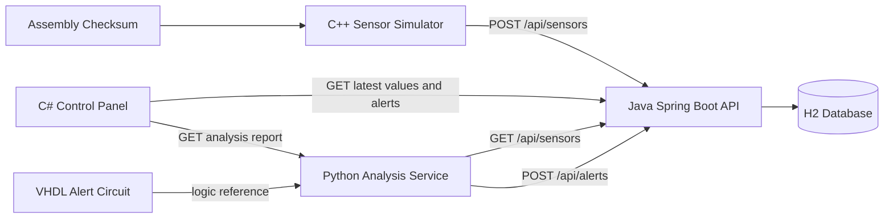

# Aerospace and Healthcare Monitoring System

A multi-language monitoring platform that simulates a real telemetry pipeline for aerospace and healthcare environments. The project is intentionally structured like a small systems-engineering demo: one component generates telemetry, one validates and stores it, one analyzes it, one presents it to an operator, one verifies packet integrity at the low level, and one models alert logic in hardware.

## Executive Summary

The system produces synthetic sensor data every second, validates packet integrity with a checksum, stores telemetry in a backend database, detects abnormal readings, and exposes alerts to a desktop control panel.

Technologies used:

1. C++ for the sensor simulator
2. Java Spring Boot for the backend API
3. Python for alert analysis and report generation
4. C# WinForms for the operator control panel
5. Assembly for packet checksum logic
6. VHDL for digital alert-signal simulation

## System View



## What The System Simulates

The telemetry packet contains:

1. `temperature`
2. `pressure`
3. `vibration`
4. `oxygenLevel`
5. `heartRate`
6. `batteryLevel`
7. `timestamp`
8. `checksum`

The project models a scenario where a device or subsystem streams operational health data into a monitoring platform. The backend becomes the source of truth, the Python service provides basic anomaly detection, and the control panel gives an operator a single place to observe system state.

## Folder Structure

```text
aerospace-healthcare-monitoring-system/
|-- assembly-checksum/
|   `-- checksum.asm
|-- cpp-simulator/
|   |-- CMakeLists.txt
|   |-- include/
|   |   `-- SensorPacket.h
|   `-- src/
|       `-- main.cpp
|-- csharp-control-panel/
|   |-- AerospaceHealthcareControlPanel.csproj
|   |-- MainForm.cs
|   `-- Program.cs
|-- docs/
|   |-- api-contract.md
|   `-- architecture.md
|-- java-backend/
|   |-- pom.xml
|   `-- src/main/
|       |-- java/com/aeromonitoring/
|       |   |-- MonitoringSystemApplication.java
|       |   |-- controller/SensorController.java
|       |   |-- dto/
|       |   |-- model/
|       |   |-- repository/
|       |   |-- service/
|       |   `-- util/ChecksumUtils.java
|       `-- resources/application.yml
|-- python-analysis/
|   |-- analyzer.py
|   |-- report_writer.py
|   |-- requirements.txt
|   |-- thresholds.py
|   `-- reports/
|-- shared/
|   `-- sensor-packet-example.json
`-- vhdl-alert-circuit/
    |-- alert_circuit.vhd
    `-- alert_circuit_tb.vhd
```

## Component Responsibilities

### C++ Sensor Simulator

- Generates fake telemetry every second.
- Builds the canonical payload string used for checksum verification.
- Calls the Assembly checksum routine when available.
- Sends packets to the Java API.

### Java Backend API

- Receives telemetry from the simulator.
- Recomputes the checksum to verify packet integrity.
- Stores sensor records in H2.
- Stores alerts generated by the Python service.
- Exposes records and alerts to downstream clients.

### Python Analysis Service

- Fetches telemetry records from the backend.
- Detects abnormal conditions using simple threshold rules.
- Publishes alerts back to the backend.
- Produces a plain-text monitoring report.

### C# Control Panel

- Starts and stops monitoring sessions.
- Shows the latest sensor values.
- Displays recent alerts.
- Exports the latest analysis report.

### Assembly Checksum Module

- Demonstrates low-level packet validation support.
- Calculates a byte-sum checksum over the canonical payload.

### VHDL Alert Circuit

- Models digital alert behavior.
- Raises `alert_signal` if any monitored danger input is active.

## Language-to-Language Communication

| From | To | Mechanism | Purpose |
|---|---|---|---|
| C++ | Java | HTTP `POST /api/sensors` | Send telemetry packets |
| Java | H2 | JPA persistence | Store records and alerts |
| Python | Java | HTTP `GET /api/sensors` | Fetch telemetry for analysis |
| Python | Java | HTTP `POST /api/alerts` | Save abnormal-condition alerts |
| C# | Java | HTTP `GET /api/sensors/latest`, `GET /api/alerts` | Drive the dashboard |
| C# | Python | HTTP `GET /api/analysis/report` | Export a human-readable report |
| Assembly | C++ | Native function call | Packet checksum generation |
| VHDL | System design | Logic simulation | Hardware-level alert model |

## Detection Rules

The Python analysis service applies these baseline rules:

1. Temperature above `80` -> high temperature alert
2. Oxygen below `90` -> low oxygen alert
3. Vibration above `70` -> vibration warning
4. Battery below `20` -> low battery alert

These rules are simple by design so the project stays beginner-friendly and easy to explain in a demo or interview.

## Suggested Run Order

1. Start the Spring Boot backend.
2. Start the Python analysis service.
3. Build and run the C++ simulator.
4. Launch the C# control panel.
5. Optionally simulate the VHDL testbench in ModelSim or GHDL.

## Current Validation Status

This repository was cleaned and validated with editor diagnostics in the current environment. Full runtime builds were not executed here because Java, C++ compiler toolchains, and a .NET SDK are not installed in this workspace environment.

## Why This Project Looks Professional

1. Each language has a clear, realistic responsibility.
2. Communication happens through explicit interfaces instead of hidden coupling.
3. The checksum rule is shared across components, which gives the system a real integrity check.
4. The project includes both software and hardware simulation layers.
5. The repository is organized so each component can be explained independently.

More detail is in [c:/Users/vtc13/Projects/aerospace-healthcare-monitoring-system/docs/architecture.md](c:/Users/vtc13/Projects/aerospace-healthcare-monitoring-system/docs/architecture.md), [c:/Users/vtc13/Projects/aerospace-healthcare-monitoring-system/docs/api-contract.md](c:/Users/vtc13/Projects/aerospace-healthcare-monitoring-system/docs/api-contract.md), [c:/Users/vtc13/Projects/aerospace-healthcare-monitoring-system/docs/runbook.md](c:/Users/vtc13/Projects/aerospace-healthcare-monitoring-system/docs/runbook.md), and [c:/Users/vtc13/Projects/aerospace-healthcare-monitoring-system/docs/source-map.md](c:/Users/vtc13/Projects/aerospace-healthcare-monitoring-system/docs/source-map.md).

## Browser Preview

If you want to see the project as a website without changing the implementation languages, open [c:/Users/vtc13/Projects/aerospace-healthcare-monitoring-system/website/index.html](c:/Users/vtc13/Projects/aerospace-healthcare-monitoring-system/website/index.html) in a browser. It is a presentation-only view built with HTML and CSS and does not replace the original C++, Java, Python, C#, Assembly, or VHDL components.